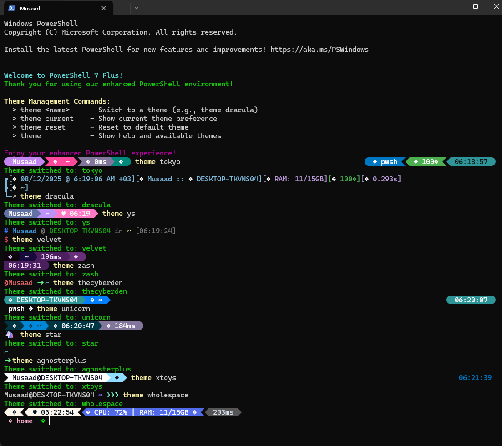

# PowerShell 7 + Oh My Posh Environment Setup

> **Automated PowerShell environment setup with modern theming and customization**

[](https://github.com/PowerShell/PowerShell)
[](https://ohmyposh.dev/)
[](https://www.microsoft.com/windows)
[](LICENSE)

## Preview

See PowerShell 7 Plus in action! The screenshot below demonstrates the beautiful themes and enhanced functionality:



**What you see:**
- **Theme Switching**: Instant theme changes with `theme <name>`
- **Rich Prompts**: Date, time, username, hostname, system stats
- **Color Coding**: Beautiful, readable terminal experience
- **System Information**: RAM, CPU, execution time display
- **Multiple Themes**: Tokyo, Dracula, YS, Velvet, Zash, TheCyberDen, Unicorn, Star, AgnosterPlus, XToys, WholeSpace, and 109 more

**Try these themes**: `theme tokyo`, `theme dracula`, `theme velvet`, `theme zash`, `theme unicorn`, `theme star`, `theme agnosterplus`, `theme wholespace`

> **Note**: The preview image shows a real PowerShell 7 Plus session with multiple theme demonstrations. Users can switch between 100+ available themes instantly using the `theme` command.

## Quick Start

### Prerequisites
- **Windows 10/11** (64-bit)
- **Internet connection** (for initial download)
- **Administrator privileges** (for installation)

### Installation

1. **Clone or download** this repository:
   ```powershell
   git clone https://github.com/MusaadTech/PowerShell-7-Plus.git
   cd PowerShell-7-Plus
   ```

2. **Run the installer**:
   ```powershell
   # Set execution policy (if needed)
   Set-ExecutionPolicy RemoteSigned -Scope CurrentUser -Force
   
   # Run the installer
   .\Install-OMPEnv.ps1
   ```

3. **Enjoy your new terminal!**

The script will:
- ✅ Install PowerShell 7 (if not present)
- ✅ Install Oh My Posh via winget
- ✅ Configure your PowerShell profile
- ✅ Set up theme management
- ✅ Install PowerShell 7 (user can set default profile manually)
- ✅ Launch your new environment

## What You Get

Transform your terminal into a **modern, powerful development environment**:

### **Enhanced Development Experience**
- **Git Integration**: Real-time Git status, branch info, and commit details
- **Environment Awareness**: Python virtual environments, Node.js versions, and more
- **Smart Path Display**: Folder icons and intelligent path truncation
- **100+ Beautiful Themes**: From minimal to feature-rich, dark to light
- **Performance Optimized**: Fast rendering with minimal startup impact
- **Cross-Platform**: Supports Windows, macOS, and Linux commands
- **Terminal Auto-Completion**: PowerShell 7 provides intelligent, context-aware auto completion for commands, parameters, file paths, and even custom functions—making it easy to discover available options and dramatically speeding up your workflow

### **One-Click Setup**
- **Automated Installation**: Installs PowerShell 7 and Oh My Posh silently
- **Intelligent Path Detection**: Locates and configures Oh My Posh in your PATH
- **Profile Management**: Creates and updates your PowerShell profile automatically
- **Theme Integration**: Installs and manages a local theme collection with dynamic switching

### **Advanced Theming**
- **100+ Built-in Themes**: Access the full Oh My Posh theme library locally
- **Dynamic Theme Switching**: Instantly change themes with the `Set-OMPTheme` function or `theme` alias for simplicity
- **Automatic Updates**: Scheduled updates keep your themes current
- **Offline Access**: All themes are stored locally for use without an internet connection

### **System Integration**
- **Windows Terminal Integration**: Installs and configures PowerShell 7 for use in Windows Terminal. User retain full control—set PowerShell 7 as your default profile in Windows Terminal settings whenever you prefer.
- **File Association**: Sets PowerShell 7 as the default for `.ps1` scripts
- **Scheduled Tasks**: Automates theme updates using Windows Task Scheduler
- **Clean Uninstall**: Easily reset your environment with `Reset-OMPEnv.ps1`

## Scripts Overview

### `Install-OMPEnv.ps1`
**Main installation script** that sets up your complete environment:

- **Step 1**: Install PowerShell 7 via winget
- **Step 2**: Install Oh My Posh via winget
- **Step 3**: Locate and configure Oh My Posh PATH
- **Step 4**: Configure POSH_THEMES_PATH environment variable
- **Step 5**: Create oh-my-posh themes directory
- **Step 6**: Create PowerShell profile
- **Step 7**: Update PSReadLine to prevent compatibility issues
- **Step 8**: Inject Oh My Posh initialization code
- **Step 9**: Sanitize profile content
- **Step 10**: Run theme updater
- **Step 11**: Configure system defaults
- **Step 12**: Refresh environment variables
- **Step 13**: Reload PowerShell profile
- **Step 14**: Restart terminal
- **Step 15**: Close current terminal

**Total: 15 steps (1-15)**

### `Reset-OMPEnv.ps1`
**Complete uninstaller** with safety confirmation that removes everything:

- **Safety First**: Requires typing 'YES' to confirm (prevents accidental execution)
- **Complete Cleanup**: Removes Oh My Posh themes directory
- **System Reset**: Unregisters scheduled tasks and removes PowerShell profile
- **Software Removal**: Uninstalls Oh My Posh and PowerShell 7
- **Path Cleanup**: Removes Oh My Posh entries from user PATH

### `Update-OMPThemes.ps1`
**Theme management script** with smart updates:

- **Smart Downloads**: Downloads latest themes from GitHub
- **Efficient Updates**: Tracks theme count to avoid unnecessary downloads
- **Automated Scheduling**: Creates scheduled task for weekly updates
- **Progress Tracking**: Provides progress indicators during download

## Installation Details

The installer automatically handles all the complex setup:

> **Note**: The installer no longer automatically sets PowerShell 7 as the default profile in Windows Terminal. Users can manually configure this through Windows Terminal settings if desired.

> **PSReadLine Compatibility**: The installer automatically updates PSReadLine to the latest version to prevent the common `Get-PSReadLineKeyHandler` errors that occur with version mismatches.

### **PowerShell 7 Installation**
- Uses winget for silent installation
- Sets as default for `.ps1` script execution
- Configures Windows Terminal integration

### **Oh My Posh Setup**
- Automatic PATH detection and configuration
- Sets up POSH_THEMES_PATH environment variable
- Creates local themes directory structure

### **Profile Configuration**
- Creates PowerShell profile if it doesn't exist
- Injects Oh My Posh initialization code
- Adds theme switching function and alias
- Sanitizes profile content for optimal performance

### **Windows Terminal Integration**
- Installs PowerShell 7 profile (user can set as default manually)
- Configures automatic profile loading
- Ensures new terminals load Oh My Posh automatically

#### Manual Default Profile Configuration
If you want PowerShell 7 as your default profile in Windows Terminal:
1. Open Windows Terminal
2. Go to Settings (Ctrl+,)
3. Select "PowerShell 7" from the profiles list
4. Click "Set as default"

## Theme Management

### Available Themes
Your local theme collection includes **100+ themes** from the official Oh My Posh repository:

```powershell
# List available themes
Get-ChildItem ".\oh-my-posh\themes\" -Filter "*.omp.json" | Select-Object Name
```

### Switching Themes
Use the built-in `Set-OMPTheme` function or the `theme` alias to switch themes instantly:

```powershell
# Switch themes using the new 'theme' alias (recommended)
theme jandedobbeleer
theme agnoster
theme powerlevel10k_modern
theme dracula

# Or use the full function name
Set-OMPTheme "jandedobbeleer"
```

### Theme Management
The installer provides comprehensive theme management with preference persistence:

#### Switching Themes
Use the built-in `theme` alias to switch themes instantly:

```powershell
# Switch themes (recommended)
theme jandedobbeleer
theme agnoster
theme powerlevel10k_modern
theme dracula

# Or use the full function name
Set-OMPTheme "jandedobbeleer"
```

#### Theme Persistence
Your theme choice is automatically saved and loaded on future sessions:

```powershell
# Check current theme preference
theme current

# Reset to default theme (immediately applies default theme)
theme reset
```

#### Available Commands
- **`theme <name>`** - Switch to a theme and save preference
- **`theme current`** - Show your current theme preference
- **`theme reset`** - Reset to default theme and reload profile immediately

### Popular Theme Examples
```powershell
# Minimal and clean
theme jandedobbeleer
theme agnoster

# Feature-rich with system info
theme powerlevel10k_modern
theme dracula

# Unique and creative
theme tokyo
theme velvet
theme unicorn
theme wholespace
```

## Troubleshooting

### Common Issues

#### "Get-PSReadLineKeyHandler positional parameter errors"
This error occurs when there's a version mismatch between PowerShell and PSReadLine:

```powershell
# Quick fix - update PSReadLine
Install-Module PSReadLine -Force

# Or re-run the installer:
.\Install-OMPEnv.ps1
```

#### Theme switching not working
If themes aren't loading properly:

```powershell
# Check if themes directory exists
Test-Path ".\oh-my-posh\themes\"

# Run theme updater to download themes
.\Update-OMPThemes.ps1

# Check current theme preference
theme current
```

#### Oh My Posh not found
If you get "Oh My Posh not available" errors:

```powershell
# Check PATH
$env:PATH -split ";" | Where-Object { $_ -like "*oh-my-posh*" }

# Re-run installer to fix PATH issues
.\Install-OMPEnv.ps1
```

#### Theme preference file location
Theme preferences are stored in the oh-my-posh directory:
```powershell
# Location of theme preference file
.\oh-my-posh\.theme-preference

# If you need to manually reset your theme preference:
Remove-Item ".\oh-my-posh\.theme-preference" -Force

# Or use the built-in command:
theme reset
```

## Acknowledgments

This project builds upon the excellent work of:

- **[Oh My Posh](https://ohmyposh.dev/)** by [Jan De Dobbeleer](https://github.com/JanDeDobbeleer) - The amazing prompt customization engine that powers beautiful, informative, and highly customizable terminal prompts
- **[PowerShell 7](https://github.com/PowerShell/PowerShell)** by Microsoft - The modern cross-platform shell that brings the power of .NET to command-line automation
- **[Windows Terminal](https://github.com/microsoft/terminal)** by Microsoft - The modern Windows terminal that provides a fast, efficient, and beautiful command-line experience

## License

This project is licensed under the MIT License - see the [LICENSE](LICENSE) file for details.

## Contributing

Contributions are welcome! Please feel free to submit a Pull Request.

## Support

If you find this project helpful, please give it a star! For issues and questions:

- **GitHub Issues**: [Create an issue](https://github.com/MusaadTech/PowerShell-7-Plus/issues)
- **Documentation**: Check this README and the troubleshooting section above
- **Reinstall**: If all else fails, run `.\Reset-OMPEnv.ps1` and then `.\Install-OMPEnv.ps1`

---

**Enjoy your enhanced PowerShell experience!**
